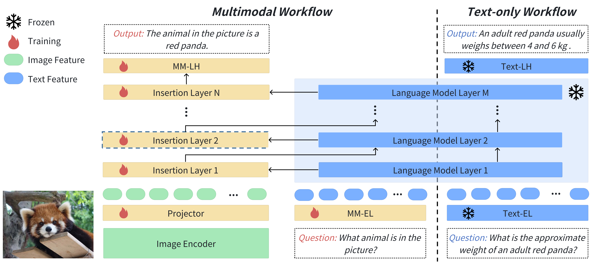
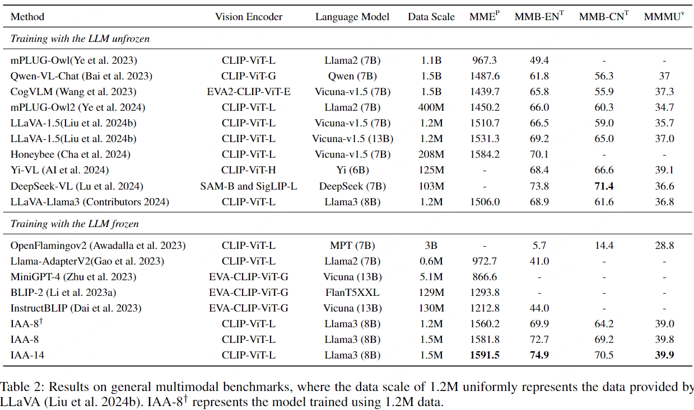
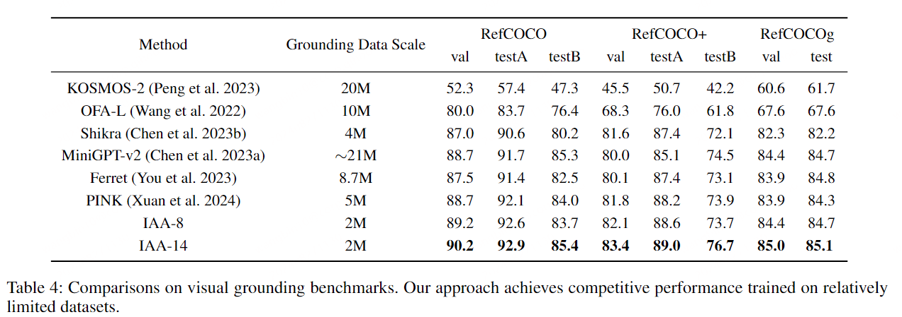
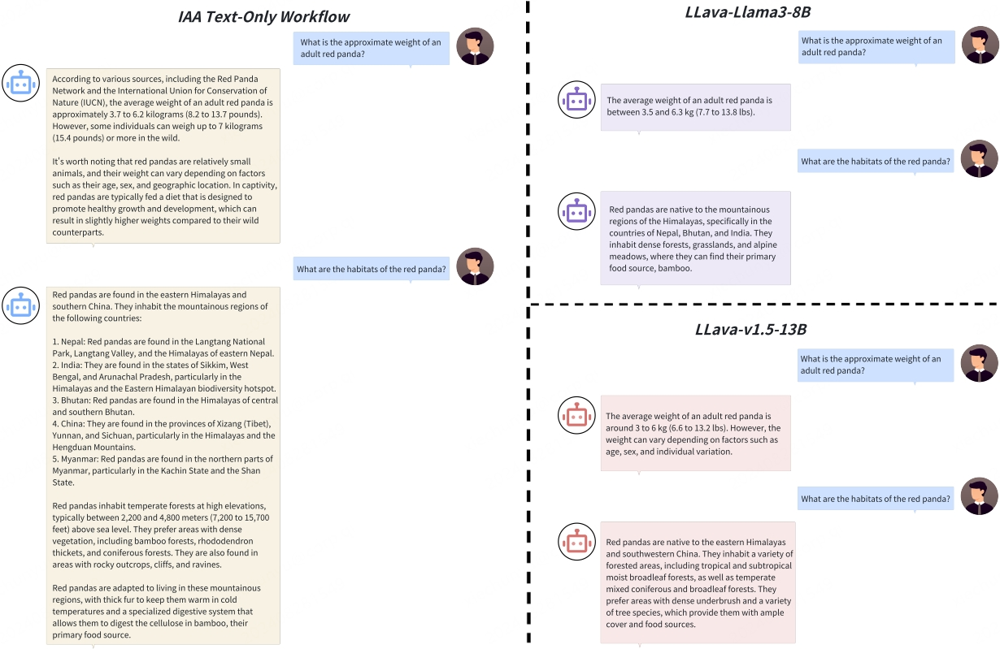

# IAA: Inner-Adaptor Architecture

This repository is the official implementation of [IAA: Inner-Adaptor Architecture](https://github.com/360CVGroup/Inner-Adaptor-Architecture/).

**[IAA: Inner-Adaptor Architecture Empowers Frozen Large Language Model with Multimodal Capabilities](https://www.arxiv.org/abs/2408.12902)** 
</br>
Bin Wang*, Chunyu Xie*, Dawei Leng†, Yuhui Yin(*Equal Contribution, ✝Corresponding Author)
</br>
[](https://www.arxiv.org/abs/2408.12902)

We propose a MLLM based on Inner-Adaptor Architecture (IAA). IAA demonstrates that training with a frozen language model can surpass the models with fine-tuned LLMs in both multimodal comprehension and visual grounding tasks. Moreover, after deployment, our approach incorporates multiple workflows, thereby preserving the NLP proficiency of the language model. With a single download, the model can be finetuned to cater to various task specifications. Enjoy the seamless experience of utilizing our IAA model.


<p align="center">
  
</p>
<!-- In the field of multimodal large language models (MLLMs), common methods typically involve unfreezing the language model during training to foster profound visual understanding. However, the fine-tuning of such models with vision-language data often leads to a diminution of their natural language processing (NLP) capabilities. To avoid this performance degradation, a straightforward solution is to freeze the language model while developing multimodal competencies. Unfortunately, previous works have not attained satisfactory outcomes. Building on the strategy of freezing the language model, we conduct thorough structural exploration and introduce the Inner-Adaptor Architecture (IAA). Specifically, the architecture incorporates multiple multimodal adaptors at varying depths within the large language model to facilitate direct interaction with the inherently text-oriented transformer layers, thereby enabling the frozen language model to acquire multimodal capabilities. Unlike previous approaches of freezing language models that require large-scale aligned data, our proposed architecture is able to achieve superior performance on small-scale datasets. We conduct extensive experiments to improve the general multimodal capabilities and visual grounding abilities of the MLLM. Our approach remarkably outperforms previous state-of-the-art methods across various vision-language benchmarks without sacrificing performance on NLP tasks. -->


## 🔥 News
- **[2025/04/15]** IAA has been accepted by AAAI2025! (https://ojs.aaai.org/index.php/AAAI/article/view/35400).
- **[2024/08/29]** We put IAA on the huggingface community! [🤗](https://huggingface.co/qihoo360).
- **[2024/08/29]** We have updated the IAA github repository, and now you can test our models!
- **[2024/08/26]** We released the paper of [IAA: Inner-Adaptor Architecture](https://www.arxiv.org/abs/2408.12902).


## Contents
- [Install](#install)
- [Model Performance](#modelperformance)
- [Quick Start 🤗](#QuickStart🤗)
- [CLI Inference](#Demo)
- [Evaluation](#evaluation)


## Install

```Shell
conda create -n IAA python=3.10 -y
conda activate IAA
bash deploy.sh
```

## Model Performance
### Main Results on General Multimodal Benchmarks. 

 <p align="center">
  
</p>

### Results on Visual Grounding Benchmarks.
<!-- grounding_re -->

 <p align="center">
  
</p>

### Comparison on text-only question answering.
<!-- grounding_re -->

 <p align="center">
  
</p>

## Quick Start 🤗
### First pull off our model
```Shell
from transformers import AutoModelForCausalLM, AutoTokenizer
import torch
from PIL import Image

checkpoint = "qihoo360/Inner-Adaptor-Architecture"

model = AutoModelForCausalLM.from_pretrained(checkpoint, torch_dtype=torch.float16, device_map='cuda', trust_remote_code=True).eval()
tokenizer = AutoTokenizer.from_pretrained(checkpoint, trust_remote_code=True)
vision_tower = model.get_vision_tower()
vision_tower.load_model()
vision_tower.to(device="cuda", dtype=torch.float16)
image_processor = vision_tower.image_processor
tokenizer.pad_token = tokenizer.eos_token

terminators = [
    tokenizer.convert_tokens_to_ids("<|eot_id|>",)
]
```


### Multimodal Workflow: task_type="MM"
```Shell
image = Image.open("readpanda.jpg").convert('RGB')
query = "What animal is in the picture?"

inputs = model.build_conversation_input_ids(tokenizer, query=query, image=image, image_processor=image_processor)

input_ids = inputs["input_ids"].to(device='cuda', non_blocking=True)
images = inputs["image"].to(dtype=torch.float16, device='cuda', non_blocking=True)

output_ids = model.generate(
    input_ids,
    task_type="MM",
    images=images,
    do_sample=False,
    eos_token_id=terminators,
    num_beams=1,
    max_new_tokens=512,
    use_cache=True)

input_token_len = input_ids.shape[1]
outputs = tokenizer.batch_decode(output_ids[:, input_token_len:], skip_special_tokens=True)[0]
outputs = outputs.strip()
print(outputs)
```

### Grounding Workflow: task_type="G"
```Shell
image = Image.open("COCO_train2014_000000014502.jpg").convert('RGB')
query = "Please provide the bounding box coordinate of the region this sentence describes: dude with black shirt says circa."

inputs = model.build_conversation_input_ids(tokenizer, query=query, image=image, image_processor=image_processor)

input_ids = inputs["input_ids"].to(device='cuda', non_blocking=True)
images = inputs["image"].to(dtype=torch.float16, device='cuda', non_blocking=True)

output_ids = model.generate(
    input_ids,
    task_type="G",
    images=images,
    do_sample=False,
    eos_token_id=terminators,
    num_beams=1,
    max_new_tokens=512,
    use_cache=True)
input_token_len = input_ids.shape[1]
outputs = tokenizer.batch_decode(output_ids[:, input_token_len:], skip_special_tokens=True)[0]
outputs = outputs.strip()
print(outputs)
```

### Text-only Workflow: task_type="Text"

```Shell
query = "What is the approximate weight of an adult red panda?"
inputs = model.build_conversation_input_ids(tokenizer, query=query)

input_ids = inputs["input_ids"].to(device='cuda', non_blocking=True)
images = None


output_ids = model.generate(
    input_ids,
    task_type="Text",
    images=images,
    do_sample=False,
    eos_token_id=terminators,
    num_beams=1,
    max_new_tokens=512,
    use_cache=True)

input_token_len = input_ids.shape[1]
outputs = tokenizer.batch_decode(output_ids[:, input_token_len:], skip_special_tokens=True)[0]
outputs = outputs.strip()
print(outputs)
```

## CLI Inference

Chat about images using IAA without the need of Gradio interface. 

```Shell
name="qihoo360/Inner-Adaptor-Architecture"
python -m iaa.eval.infer \
    --model-path $name \
    --image-path testimg/readpanda.jpg \
    --task_type MM \
```
```Shell
name="qihoo360/Inner-Adaptor-Architecture"

python -m iaa.eval.infer_interleave \
    --model-path $name \
    --image-path testimg/COCO_train2014_000000014502.jpg \
```

## Evaluation

First, download the MME image from the following link to ./MME/MME_Benchmark_release_version.
https://github.com/BradyFU/Awesome-Multimodal-Large-Language-Models/tree/Evaluation

```Shell
bash scripts/mme.sh
```

For Refcoco testing, please refer to the following links for data downloads
https://github.com/lichengunc/refer

```Shell
bash scripts/refcoco.sh
```

<!-- ## Acknowledgement -->
## We Are Hiring
We are seeking academic interns in the Multimodal field. If interested, please send your resume to xiechunyu@360.cn.
## Citation
If you find IAA useful for your research and applications, please cite using this BibTeX:

```
@article{Wang2024IAA,
  title={IAA: Inner-Adaptor Architecture Empowers Frozen Large Language Model with Multimodal Capabilities},
  author={Bin Wang and Chunyu Xie and Dawei Leng and Yuhui Yin},
  journal={arXiv preprint arXiv:2408.12902},
  year={2024},
}
```

## License

This project utilizes certain datasets and checkpoints that are subject to their respective original licenses. Users must comply with all terms and conditions of these original licenses.
The content of this project itself is licensed under the [Apache license 2.0](./LICENSE).

## Related Projects
This work wouldn't be possible without the incredible open-source code of these projects. Huge thanks!
- [Meta Llama 3](https://github.com/meta-llama/llama3)
- [LLaVA: Large Language and Vision Assistant](https://github.com/haotian-liu/LLaVA)
- [360VL](https://github.com/360CVGroup/360VL)


